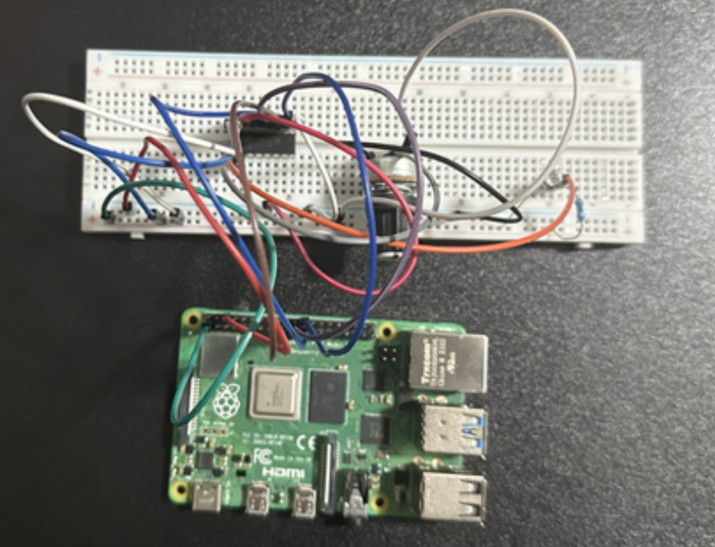

# PROJECT 2 - CSC 591 (IoT)

## Overview

This project demonstrates an IoT system using MQTT communication protocol with multiple Raspberry Pi devices, sensors, and actuators. The system implements a distributed sensor network with real-time data collection and control capabilities.

## Getting Started

Check each folder's `README.md` to learn how to install dependencies and run the specific programs for each component.

## Hardware Requirements

### Raspberry Pi Devices
- **3 Raspberry Pi boards** (Pi 3B+ or Pi 4 recommended)
- MicroSD cards (32GB recommended for each Pi)
- Power supplies for each Raspberry Pi

### Electronic Components
- **1 Breadboard** (full-size recommended)
- **1 Potentiometer** (10kΩ recommended)
- **1 ADC (Analog to Digital Converter)** - MCP3008
- **1 LDR (Light Dependent Resistor)**
- **3 LED bulbs** (different colors recommended)
- Resistors (220Ω for LEDs, 10kΩ pull-up resistors)
- Jumper wires (male-to-male, male-to-female)

### Computing Devices
- **2 Laptops**
  - Laptop 1: Acts as MQTT broker
  - Laptop 2: Subscribes to all topics published to the broker

## System Architecture

```
┌─────────────┐    ┌─────────────┐    ┌─────────────┐
│ Raspberry   │    │ Raspberry   │    │ Raspberry   │
│ Pi A        │    │ Pi B        │    │ Pi C        │
│ (Sensors)   │    │ (Control)   │    │ (LightBulb) │
└──────┬──────┘    └──────┬──────┘    └──────┬──────┘
       │                  │                  │
       │        MQTT Messages over WiFi      │
       │                  │                  │
       └──────────────────┼──────────────────┘
                          │
                  ┌───────┴────────┐
                  │ MQTT Broker    │
                  │ (Laptop 1)     │
                  └───────┬────────┘
                          │
                  ┌───────┴────────┐
                  │ Subscriber     │
                  │ (Laptop 2)     │
                  └────────────────┘
```

## Project Structure

```
PROJECT-2/
├── images
│   ├── pi_a.png
│   ├── pi_a_schematic.png
│   ├── pi_b.png
│   ├── pi_b_schematic.png
│   └── pi_c.png
├── laptop_1
│   └── README.md
├── laptop_2
│   ├── new_laptop_2.py
│   └── README.md
├── pi_a
│   ├── new_pi_a.py
│   └── README.md
├── pi_b
│   ├── new_pi_b.py
│   └── README.md
├── pi_c
│   ├── new_pi_c.py
│   └── README.md
└── README.md
```

### Images of PI with Breadboard
#### PI A & BreadBoard


#### PI B & BreadBoard


#### PI C 


### Schematic Diagrams
#### PI A Schematic Diagram


#### PI B Schematic Diagram


## Contributors

## Contributors
| Name              | GitHub Profile                                         | Profile Picture |
|-------------------|--------------------------------------------------------|----------------|
| Dinesh Karnati    | [DineshK100](https://github.com/DineshK100)           |  |
| Siddhant Joshi    | [sidjoshi29](https://github.com/sidjoshi29)           |  |
| Pratik Thapa      | [SyntaxErrorThapa](https://github.com/SyntaxErrorThapa)|  |

## Course Information

- **Course**: CSC 591 - Internet of Things
- **Institution**: [North Carolina State University]
- **Semester**: [Fall 2025]
- **Instructor**: [Muhammad Shahzad]